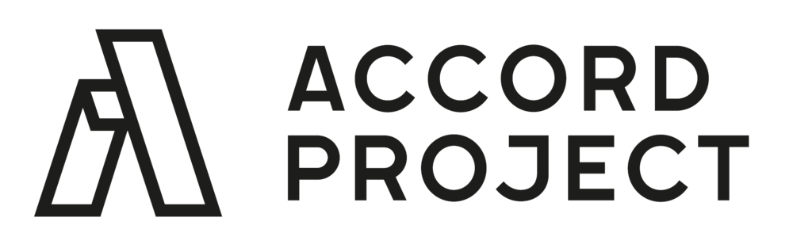

## Introduction

Cicero allows you to define natural language contract and clause templates that can be executed by a computer. These could be relatively simple things like `if the goods are more than [{DAYS}] late, then notify the supplier of the goods, with the message [{MESSAGE}].` or more elaborate natural language and logic such as computing interest on a loan, or calculating penalties based on IoT sensor readings.

You can browse the library of Open Source Cicero contract and clause templates at: https://templates.accordproject.org.

Cicero is an Open Source implementation of the [Accord Project Template Specification][apspec]. It defines the structure of natural language templates, bound to a data model, that can be executed using request/response JSON messages.

You can read the latest user documentation here: http://docs.accordproject.org.

## Smart Clause

Using Cicero you can take any existing natural language text (typically a clause or a contract) and declaratively bind it to a data model. Cicero generates a parser (using the Earley parser algorithm) to parse and validate source text, extracting machine readable/computable data. The Cicero engine can then be used to execute a Smart Clause (an instance of a template) against a JSON payload. Smart Clause software can be used to add computable functionality to any document. Clauses are typically stateless (idempotent) functions. They receive an incoming request and the template data, and they produce a response.

## Get Involved!

We are an open community and welcome both lawyers and technologists to work on the specifications and code. If you would like to get involved please join the Accord #technology-wg Slack channel by signing up here: https://www.accordproject.org.

[Accord Technology Working Group weekly meeting][apworkgroup]

## Structure of the Code Repository

Top level repository (cicero), with sub packages. Each sub-package is published as an independent npm module using `lerna`:
* cicero-cli : Command line interface (for parsing, execution, creating archives) for Accord Project legal templates
* cicero-core : Core classes to manage the grammar, models and logic of Accord Project legal templates
* cicero-engine : A Node.js VM based execution engine for Accord Project legal templates
* cicero-server: Exposes the Cicero Engine as a RESTful service
* cicero-test : Cucumber based testing for Accord Project legal templates
* cicero-tools : Tools for generating code (UML, Java, etc.) from Accord Project legal templates
* generator-cicero-template: Utility to create a self-contained directory for a new Accord Project legal template

© 2017-2019 Clause, Inc.

---

Accord Project is an open source, non-profit, initiative working to transform contract management and contract automation by digitizing contracts.

## Contributing

Read our [contributing guide][contribute] and information for [developers][developer]. Find out what’s coming on our [blog][apblog].

## Getting Started

### Learn About Accord Project
* [Welcome][welcome]
* [Concepts and High-level Architecture][highlevel]
* [Ergo Language][ergolanguage]

### Try Accord Project
* [Using a Template with Cicero][usingcicero]
* [Authoring in Template Studio][authoring]

### Technical Reads
* [Ergo Compiler][ergocompiler]

### Blog
* [Accord Project News][apnews]

### Accord Project Codebase
* [Cicero][cicero]
* [Ergo][ergo]
* [Cicero Template Library][CTL]
* [Models][models]

* [Template Studio][tsv2]
* [Cicero UI][ciceroui]
* [Concerto UI][concertoui]
* [Markdown Editor][mdeditor]

## Community

The Accord Project technology is being developed as open source. All the software packages are being actively maintained on GitHub and we encourage organizations and individuals to contribute requirements, documentation, issues, new templates, and code.

Join the Accord Project Technology Working Group [Slack channel][slack] to get involved!

## License  Cicero

Accord Project source code files are made available under the [Apache License, Version 2.0][apache].

Accord Project documentation files are made available under the [Creative Commons Attribution 4.0 International License][creativecommons] (CC-BY-4.0).

[apspec]: https://docs.accordproject.org/docs/cicero-specification.html
[apworkgroup]: https://calendar.google.com/calendar/event?action=TEMPLATE&tmeid=MjZvYzIzZHVrYnI1aDVzbjZnMHJqYmtwaGlfMjAxNzExMTVUMjEwMDAwWiBkYW5AY2xhdXNlLmlv&tmsrc=dan%40clause.io

[contribute]: https://github.com/accordproject/template-studio-v2/blob/master/CONTRIBUTING.md
[developer]: https://github.com/accordproject/template-studio-v2/blob/master/DEVELOPERS.md
[apblog]: (https://medium.com/@accordhq)

[welcome]: https://docs.accordproject.org/docs/accordproject.html#what-is-accord-project
[highlevel]: https://docs.accordproject.org/docs/spec-concepts.html
[ergolanguage]: https://docs.accordproject.org/docs/logic-ergo.html

[usingcicero]: https://docs.accordproject.org/docs/basic-use.html
[authoring]: https://docs.accordproject.org/docs/advanced-latedelivery.html

[ergocompiler]: https://docs.accordproject.org/docs/ref-logic-specification.html

[apnews]: https://www.accordproject.org/news/
[cicero]: https://github.com/accordproject/cicero
[ergo]: https://github.com/accordproject/ergo
[CTL]: https://github.com/accordproject/cicero-template-library
[models]: https://github.com/accordproject/models

[tsv2]: https://github.com/accordproject/template-studio-v2
[ciceroui]: https://github.com/accordproject/cicero-ui
[concertoui]: https://github.com/accordproject/concerto-ui
[mdeditor]: https://github.com/accordproject/markdown-editor

[slack]: https://accord-project-slack-signup.herokuapp.com
[apache]: https://github.com/accordproject/template-studio-v2/blob/master/LICENSE
[creativecommons]: http://creativecommons.org/licenses/by/4.0/
