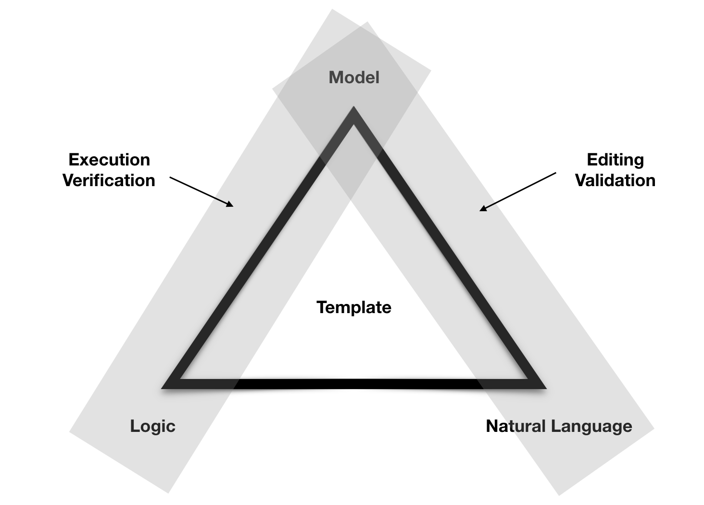
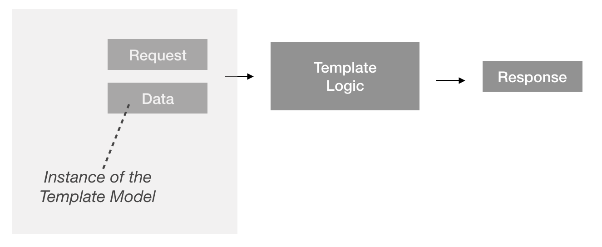

Template 
========

A template is composed of three elements: 

- Template Grammar, the natural language text for the template 
- Template Model, the data model that backs the template 
- Logic, the executable business logic for the template

When combined these three elements allow templates to be edited, analyzed, queried and executed.

A complete sample template is available here:
https://github.com/accordproject/cicero-template-library/tree/master/latedeliveryandpenalty

Template Grammar 
----------------

The template grammar for a template captures the natural language structure of the template. It is
UTF-8 text with markup to introduce named variables.

Here is a simple template grammar::

   Late Delivery and Penalty. In case of delayed delivery[{" except for Force
   Majeure cases,":? forceMajeure}] the Seller shall pay to the Buyer for every
   [{penaltyDuration}] of delay penalty amounting to [{penaltyPercentage}]% of
   the total value of the Equipment whose delivery has been delayed. Any
   fractional part of a [{fractionalPart}] is to be considered a full
   [{fractionalPart}]. The total amount of penalty shall not however, exceed
   [{capPercentage}]% of the total value of the Equipment involved in late
   delivery. If the delay is more than [{termination}], the Buyer is entitled to
   terminate this Contract.

Variables in template grammars are enclosed in ``[{`` and ``}]``.

Template Model
--------------

The model for a template captures the names and types of the variables. 
Template models are expressed using the `Hyperledger Composer Modeling Language`_, a runtime neutral, 
text-based data-definition (schema) language.

.. _`Hyperledger Composer Modeling Language`: https://hyperledger.github.io/composer/reference/cto_language.html

Here is a sample template model::

    @AccordTemplateModel("latedeliveryandpenalty")
    concept TemplateModel {
        /**
        * Does the clause include a force majeure provision?
        */
        o Boolean forceMajeure

        /**
        * For every penaltyDuration that the goods are late
        */
        o Duration penaltyDuration

        /**
        * Seller pays the buyer penaltyPercentage % of the value of the goods
        */
        o Double penaltyPercentage

        /**
        * Up to capPercentage % of the value of the goods
        */
        o Double capPercentage

        /**
        * If the goods are >= termination late then the buyer may terminate the contract
        */
        o Duration termination

        /**
        * Fractional part of a ... is considered a whole ...
        */
        o TemporalUnit fractionalPart
    }

Template Logic 
--------------

The logic for a template is written as a set of JavaScript functions. The JavaScript functions are
invoked by the engine when transactions are received for processing and return a response. Both the 
incoming requests and responses are modeled types.

Here is a sample JavaScript function::

    /** 
    * Execute the smart clause 
    * @param {Context} context - the Accord context 
    * @param {io.clause.latedeliveryandpenalty.LateDeliveryAndPenaltyRequest}
    * context.request - the incoming request 
    * @param {io.clause.latedeliveryandpenalty.LateDeliveryAndPenaltyResponse}
    * context.response - the response * @AccordClauseLogic 
    */
    function execute(context) {

        logger.info(context); var req = context.request; var res =
        context.response; var data = context.data; var now =
        moment(req.timestamp); var agreed = moment(req.agreedDelivery);

        res.buyerMayTerminate = false; res.penalty = 0;

        if (req.forceMajeure) {
            logger.info('forceMajeure'); res.buyerMayTerminate = true;
        }

        if (!req.forceMajeure && now.isAfter(agreed)) {
            logger.info('late'); logger.info('penalty duration unit: ' +
            data.penaltyDuration.unit); logger.info('penalty duration amount: '
            + data.penaltyDuration.amount); // the delivery is late var diff =
            now.diff(agreed, data.penaltyDuration.unit); logger.info('diff:' +
            diff);

            var penalty = (diff / data.penaltyDuration.amount) *
            data.penaltyPercentage/100 * req.goodsValue;

            // cap the maximum penalty if (penalty > data.capPercentage/100 *
            req.goodsValue) {
                logger.info('capped.'); penalty = data.capPercentage/100 *
                req.goodsValue;
            }

            res.penalty = penalty;

            // can we terminate? if (diff > data.termination) {
                logger.info('buyerMayTerminate.'); res.buyerMayTerminate = true;
            }
        }
    }

Note that the type information in the JSDoc comments is used to route incoming transactions to the
JavaScript function.

Template Library 
================

Templates may be organized into a Template Library, typically stored on GitHub (either public or private).
For example:
https://github.com/accordproject/cicero-template-library

Clause 
======

A Clause is an instance of a Template, where the variables for the template have been set to specific values.
A Clause may be instantiated by either parsing natural language text that conforms to the structure of the 
template grammar, or may be instantiated from a JSON object that is an instance of the Template Model for the
template.

Engine 
======

Cicero includes a Node.js VM based execution engine. The engine routes incoming transactions to template functions,
performs data validation, executes the functions within a sandboxed environment, and then validates the response
before returning it to the caller.

